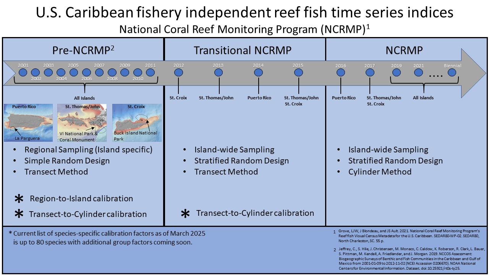

# Initial assessment of NCMRP Caribbean species for inclusion to SEDAR

## Criteria for inclusion

1)  Current calibration factor to ensure a time-series can go back to 2001. Calibration factors were developed to properly handle methodology changes.

2)  Species had at least 1% domain-wide occurrence in any of the modern NCRMP years (2016-present)

## Metrics

A table of survey estimated metrics will be provided for each island group.

-   **Sample Number:** Number of field samples collected
-   **Density:** Weighted domain-wide density ($num/177m^2$)
-   **Density CV:** Coefficient of variation of density
-   **Occurrence:** Weighted domain-wide frequency of occurrence
-   **Occurrence CV:** Coefficient of variation of occurrence
-   **Number of Observations:** Number of individual species lengths recorded
